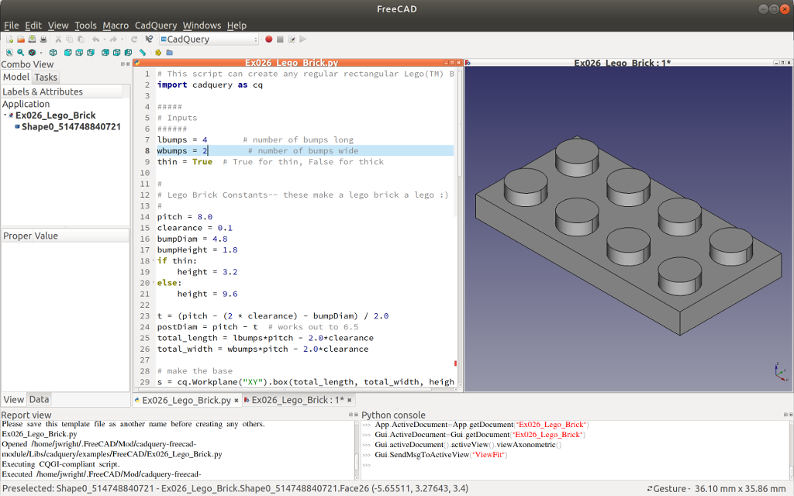

## CadQuery Module for FreeCAD

### Documentation
- [Introduction](index.md#introduction)
- [Installation](installation.md)
- [Usage](usage.md)
- [Developers](developers.md)

### Introduction

This project adds a workbench to FreeCAD that makes it possible to execute and use [CadQuery](https://github.com/CadQuery/cadquery) models with other FreeCAD workbenches.

This workbench was re-written to work with FreeCAD 1.0 and newer, and has not been tested with earlier versions.

[Installation>](installation.md)
