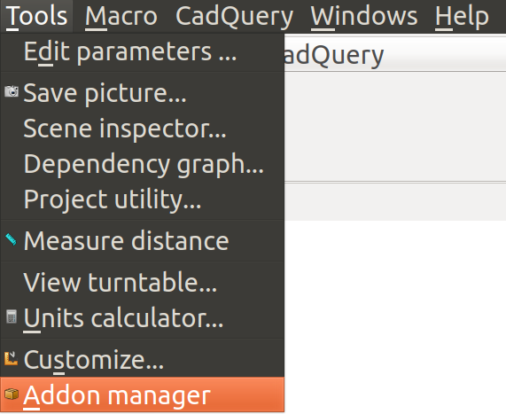
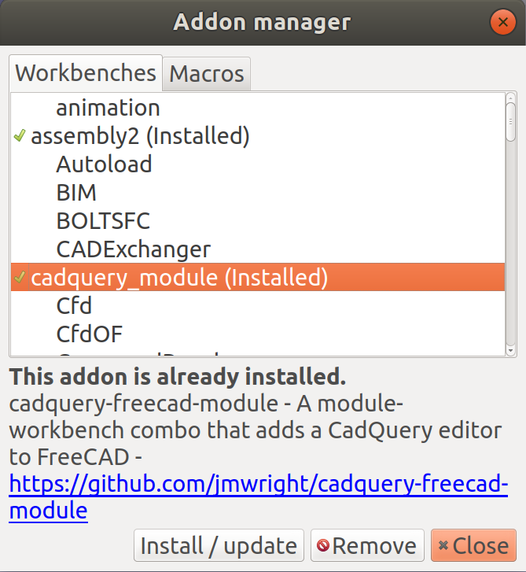
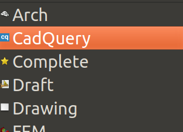

[<Back to Main](index.md)
## Installation

### Table of Contents
- [Automated](installation.md#automated)
- [Manual](installation.md#manual)
- [Troubleshooting](installation.md#troubleshooting)
- [Next Steps](installation.md#next-steps)

### Automated
If you are running FreeCAD 0.17 or newer, which is recommended, this module is easy to install through the included addon manager.
1. Run the FreeCAD Addon Manager by clicking `Tools->Addon manager`

2. Scroll down and click on `cadquery_module`

3. Click the `Install / update` button
3. Restart FreeCAD
4. Confirm that CadQuery is in the drop down menu of available workbenches



This process can be repeated to update the module every time changes are pushed to the master branch on GitHub.

### Manual
Sometimes a different version or branch of the workbench may be needed, other than what is installed using the addon manager. The steps below outline
1. Download the [latest released version](https://github.com/jmwright/cadquery-freecad-module/releases)
2. Extract the archive file
3. Copy the entire extracted directory to FreeCAD's `Mod` directory on your system. Typical `Mod` directory locations are listed below.

**Linux Mod Locations**
- /usr/lib/freecad/Mod
- /usr/local/lib/freecad/Mod
- ~/.FreeCAD/Mod

**Windows Mod Locations**
- C:\Program Files\FreeCAD 0.14\Mod
- C:\Program Files (x86)\FreeCAD 0.14\Mod
- C:\Users\[your_user_name]\Application Data\FreeCAD\Mod

**Mac Mod Locations**
- /Applications/FreeCAD.app/Contents/Mod
- /Applications/FreeCAD.app/Mod
- /Users/[your_user_name]/Library/Preferences/FreeCAD/Mod
- ~/Library/Preferences/FreeCAD/Mod

### Troubleshooting
If you are running Ubuntu Linux, you may need to run the following line in a terminal before using this module.
```
sudo apt-get install python-pyside.qtnetwork
```

### Next Steps
Once the workbench is installed, the next step is to read through the [usage instructions](usage.md).
