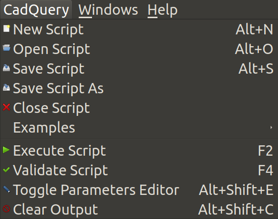
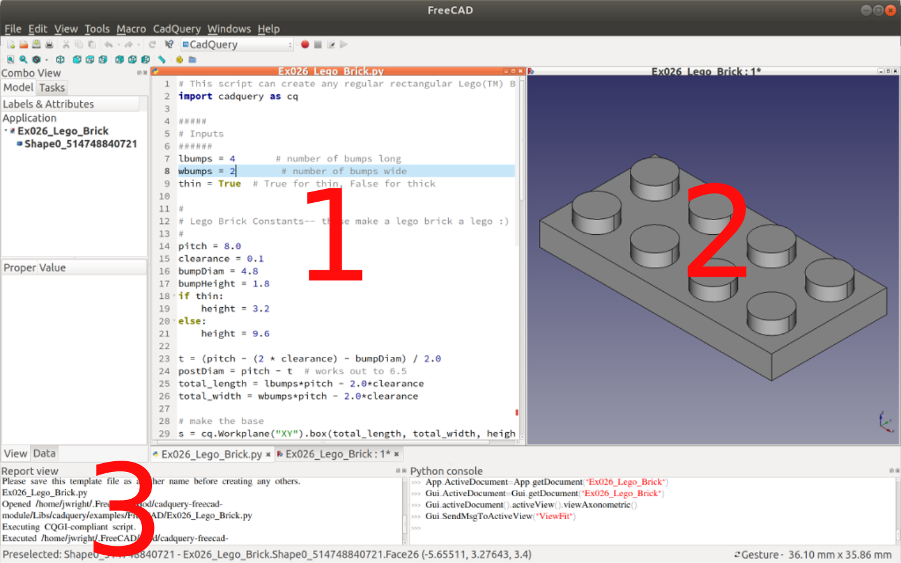
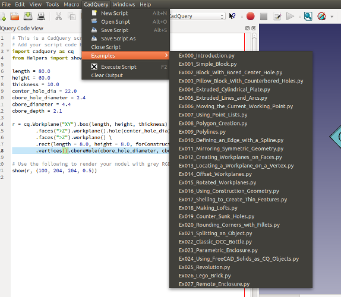

[<Back to Main](index.md)
## Usage

### Table of Contents
- [Getting Started](usage.md#getting-started)
- [Components of the CadQuery Workbench](usage.md#components-of-the-cadquery-workbench)
- [Examples](usage.md#examples)
- [Settings](usage.md#settings)
- [Environment Variables](usage.md#environment-variables)
- [Using an External Code Editor](usage.md#using-an-external-code-editor)
- [cqparts](usage.md#cqparts)
- [Getting Help](usage.md#getting-help)

### Getting Started
Once you have installed the module and started FreeCAD, you should see a CadQuery entry in the Workbenches pull down list.


After selecting the CadQuery workbench, a `CadQuery` menu will appear in the menu bar.



The menu items are as follows, and many of them have associated shortcut keys listed.
* **New Script** (Alt+N) - Starts a new CadQuery script, using a simple template.
* **Open Script** (Alt+O) - Opens a CadQuery script that was previously created.
* **Save Script** (Alt+S) - Saves the current CadQuery script to disk. Presents a Save-As dialog if this is the first time saving the file.
* **Save Script As** - Save a copy of a script, allowing it to be renamed.
* **Close Script** - Closes the current CadQuery script and removes associated code and 3D view documents.
* **Examples** (sub-menu) - Holds a list of all the CadQuery examples that are bundled with this module. They're a great tool for learning CadQuery.
* **Execute Script** (F2) - Takes the code in the currently active script and executes it to generate geometry in a 3D view.
* **Validate Script** (F4) - If a script incorporates the `show_object` function, this takes the code in the currently active script and checks it for potential errors.
* **Toggle Parameters Editor** (Alt+Shift+C) - If a script incorporates the `show_object` function, this opens a dialog displaying the variables from the script. These can be changed dynamically and will alter the scripts 3D output when F2 is pressed to execute the script.
* **Clear Output** (Alt+Shift+C) - Clears all output from the Report View. This comes in handy during a heavy script debugging session.

### Components of the CadQuery Workbench
There are three main sections to the CadQuery workbench.



1. **Code Editor** - This is a full-featured editor that is added by the workbench, and is the default location to edit scripts. It has features such as auto-complete, syntax highlighting and checking, line numbers, and code folding. The editor opens in a FreeCAD document tab, so it is possible to tile the code editor and the 3D view side-by-side for faster model development. _Note: The CadQuery editor is a fork of the [PyQode project](https://github.com/pyQode/pyQode)._
2. **3D View** - This is the standard FreeCAD 3D view. It displays the geometry generated by the script in the _Code Editor_ when the script is executed. It can be tiled side-by-side with the _Code Editor_ for faster model development.
3. **Report View** - This is also the standard FreeCAD report view, but it is used to display output and errors from the script in the _Code Editor_. If your script does not execute properly, this is the first place to look.

### Examples
The CadQuery workbench includes embedded example scripts to make it easier to get started with CadQuery. Examples are located in the Examples sub-menu (`CadQuery->Examples`), and are executed by pressing F2 or selecting the _Execute Script_ menu item (`CadQuery->Execute Script`).



The examples are being expanded and updated frequently, so it's worth checking the Examples submenu periodically.

### Settings

[Settings.py](https://github.com/jmwright/cadquery-freecad-module/blob/master/Settings.py) has been placed in the root of the workbench's directory. Modifications can be made to this file to change some aspects of operation. A restart of FreeCAD, or leaving the workbench and then coming back is required after making changes to `Settings.py`.

* **execute_on_save** - Automatically execute a script every time you save. The default is `False`.
* **use_external_editor** - Automatically reloads and executes the open script when an external change is made. This allows users to use their preferred code editor instead of the one included with this module. The default is `False`.
* **max_line_length** - The number of characters per line that is allowed before a line length warning is given. The default is `79` to help make scripts PEP8 compliant.
* **font_size** - Sets the font size of the embedded Python editor (PyQode). Default is 10.
* **execute_keybinding** - Allows a user to set the key (or key combo) that will execute the currently active script. Defaults to 'F2' and follows the [Qt shortcut key](https://doc.qt.io/qtcreator/creator-keyboard-shortcuts.html) conventions.
* **report_execute_time** - Controls whether or not to display the time it took to execute a script. The script being executed must be [CQGI (CadQuery Gateway Interface)](http://dcowden.github.io/cadquery/cqgi.html) compliant, meaning that it uses the `show_object` function. Default is False.

### Environment Variables

Environment variables are set when a script is executed to give access to the path the script is running from. This is needed because of the way the workbench executes scripts from a temporary file, which may render things like settings files in the script's home directory unavailable. To access these environment variables, use `import os` and then `os.environ.get("VARIABLE_NAME")`.

* **MYSCRIPT_FULL_PATH** - Includes the full path and filename of the script being executed.
* **MYSCRIPT_DIR** - Full path excluding the filename, giving the directory the script resides in.

Here is an example of retrieving the value and using these environment variables:

```python
import os

config = '{path:s}/config.yaml'.format(path=os.environ.get("MYSCRIPT_DIR"))
file = open(config, 'r')
print(file.read())
```

### Using an External Code Editor

Oftentimes, users prefer another code editor or IDE over the one that is built in to this workbench. In order to use an external editor, set `use_external_editor` to `True` in `Settings.py`. A restart of FreeCAD will most likely be required to make this change take effect. With this option enabled, a script can be opened in the workbench's internal code editor initially, and then edited from there on within an external editor. The internal editor will update automatically and the 3D view will automatically be refreshed when the script changes.

If you are using an external editor that supports type annotations, the [cadqury_stubs](https://github.com/Grawp/cadquery_stubs) can be helpful. This helps with things like auto-completion and argument type hinting.

### cqparts

[cqparts](https://github.com/fragmuffin/cqparts) is a library which adds support layer for parts and assemblies on top of CadQuery, and aims to be a parts generator repository for more complex CadQuery mechanical assemblies. This workbench implements full support for cqparts, and scripts from that project's examples can be used as-is.


### Getting Help

- Need help using this workbench? You can open an issue [here](https://github.com/jmwright/cadquery-freecad-module/issues), or join the [CadQuery Google Group](https://groups.google.com/forum/#!forum/cadquery) and ask your question there.
- Need help using CadQuery? You can open an issue over [there](https://github.com/dcowden/cadquery/issues), or join the [CadQuery Google Group](https://groups.google.com/forum/#!forum/cadquery) and ask your question there. Complete documentation for CadQuery is also available [here](http://dcowden.github.io/cadquery/).

[<Back to Main](index.md)
