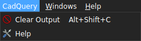
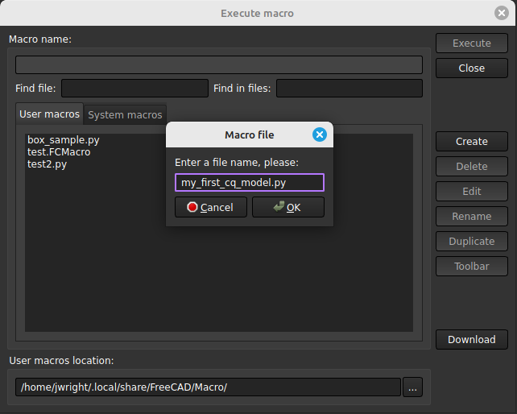
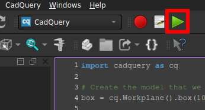

[<Back to Main](index.md)
## Usage

### Table of Contents

- [Getting Started](usage.md#getting-started)
- [Components of the CadQuery Workbench](usage.md#components-of-the-cadquery-workbench)
- [Examples](usage.md#examples)
- [Settings](usage.md#settings)
- [Environment Variables](usage.md#environment-variables)
- [Using an External Code Editor](usage.md#using-an-external-code-editor)
- [cqparts](usage.md#cqparts)
- [Getting Help](usage.md#getting-help)

### Getting Started

Once you have installed the module and started FreeCAD, you should see a CadQuery entry in the Workbenches pull down list.


After selecting the CadQuery workbench, a `CadQuery` menu will appear in the menu bar.



The menu items are as follows, and many of them have associated shortcut keys listed.
* **Clear Output** (Alt+Shift+C) - Clears all output from the Report View. This comes in handy during a heavy script debugging session.
* **Help** - Opens a help dialog with version information and documentation links.

Selecting the CadQuery workbench does one aditional thing that makes CadQuery usable in FreeCAD. It temporarily (not preserved between restarts) adds a method called `show_object` to the Python globals. This allows FreeCAD's built-in Macro Editor to display and update CadQuery models by calling `show_object` and passing it a CadQuery `Workplane` object. This workbench does not yet support CadQuery `Assembly` objects.

### First Coding Session

First open the Macro Editor by clicking `Macro->Macros...` in the menu bar. Doing so will oepn the `Execute macro` dialog box. You can then click the `Create` button and give your script a name. CadQuery files typically end in `.py`, so it is best to use that rather than the `.FCMacro` extension.



Clicking the `OK` button will create the macro/script and open it in a document tab.

As a start, you can enter the following script in the macro document tab.

```python
import cadquery as cq

# Create the model that we want to display
box = cq.Workplane().box(10, 10, 5)

# You can output a message to FreeCAD's Report view
print("I want to display something in the Report view")

# You can set a custom name for for the part object in FreeCAD's model tree
box.val().label = "My_Box"

# Display the object in a new document tab
show_object(box)
```

Save the macro (Ctrl+S) and then click the green `Execute macro` button (Ctrl+F6).



The model should be displayed in a new document tab, and any subsequent executions after change the script should cause the model to update, assuming that you do not change the label name.

**NOTE:** The first model execution after opening FreeCAD will likely be a little slow because CadQuery and all of its dependencies have to be loaded. However, after the first execution, model updates should be displayed more quickly.


An `options` parameter is used with the `show_object` method which allows the `color` and `alpha` (transparency) of the model to be changed. Below is a code example.

```python
show_object(box, options={"color": (64, 164, 223), "alpha": 0.8})
```

Notice that these options follow the pattern used in [CQ-editor](https://github.com/CadQuery/CQ-editor), which is done to ensure compatibility across CadQuery environments, but may not follow FreeCAD standards for color and transparency.

### Using an External Code Editor

This feature is not currently implemented, but is planned for the future.

### Getting Help

- Found a bug while using this workbench? You can open an issue [here](https://github.com/CadQuery/cadquery-freecad-workbench/issues)
- Need help using this workbench? Join the [CadQuery Google Group](https://groups.google.com/forum/#!forum/cadquery) and ask your question there. Alternatively, you can join CadQuery's [Discord community](https://discord.com/invite/Bj9AQPsCfx) and ask your question in the `#other-guis` channel.

[<Back to Main](index.md) | [Developers>](developers.md)
